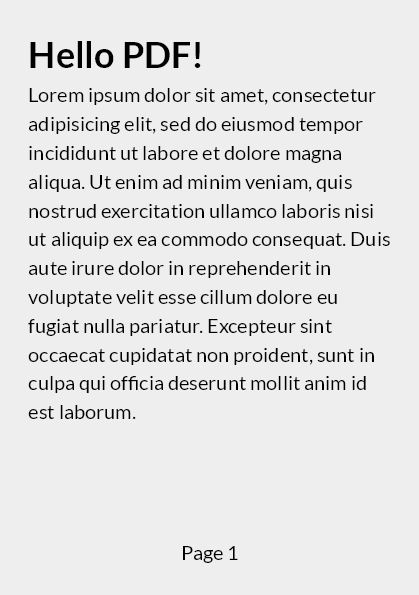

#  Verify.QuestPDF

[](https://ci.appveyor.com/project/SimonCropp/Verify-QuestPDF)
[](https://www.nuget.org/packages/Verify.QuestPDF/)

Extends [Verify](https://github.com/VerifyTests/Verify) to allow verification of documents via [QuestPDF](https://www.questpdf.com/).

Designed to help assert the output of projects using QuestPDF to generate PDFs.


## NuGet package

https://nuget.org/packages/Verify.QuestPDF/


## Usage

Enable:

<!-- snippet: ModuleInitializer.cs -->
<a id='snippet-ModuleInitializer.cs'></a>
```cs
public static class ModuleInitializer
{
    [ModuleInitializer]
    public static void Init() =>
        VerifyQuestPdf.Initialize();
}
```
<sup><a href='/src/Tests/ModuleInitializer.cs#L1-L6' title='Snippet source file'>snippet source</a> | <a href='#snippet-ModuleInitializer.cs' title='Start of snippet'>anchor</a></sup>
<!-- endSnippet -->


### Code that generates a document 

<!-- snippet: GenerateDocument -->
<a id='snippet-generatedocument'></a>
```cs
static IDocument GenerateDocument() =>
    Document.Create(container =>
    {
        container.Page(page =>
        {
            page.Size(PageSizes.A5);
            page.Margin(1, Unit.Centimetre);
            page.PageColor(Colors.Grey.Lighten3);
            page.DefaultTextStyle(x => x.FontSize(20));

            page.Header()
                .Text("Hello PDF!")
                .SemiBold().FontSize(36);

            page.Content()
                .Column(x =>
                {
                    x.Item()
                        .Text(Placeholders.LoremIpsum());
                });

            page.Footer()
                .AlignCenter()
                .Text(x =>
                {
                    x.Span("Page ");
                    x.CurrentPageNumber();
                });
        });
    });
```
<sup><a href='/src/Tests/Samples.cs#L16-L49' title='Snippet source file'>snippet source</a> | <a href='#snippet-generatedocument' title='Start of snippet'>anchor</a></sup>
<!-- endSnippet -->


### Verify a Document

<!-- snippet: VerifyDocument -->
<a id='snippet-verifydocument'></a>
```cs
[Test]
public Task VerifyDocument() =>
    Verify(GenerateDocument());
```
<sup><a href='/src/Tests/Samples.cs#L8-L14' title='Snippet source file'>snippet source</a> | <a href='#snippet-verifydocument' title='Start of snippet'>anchor</a></sup>
<!-- endSnippet -->


### Results


#### Metadata

<!-- snippet: Samples.VerifyDocument.00.verified.txt -->
<a id='snippet-Samples.VerifyDocument.00.verified.txt'></a>
```txt
{
  CreationDate: DateTime_1,
  ModifiedDate: DateTime_2,
  ImageQuality: 101,
  PdfA: false,
  RasterDpi: 72
}
```
<sup><a href='/src/Tests/Samples.VerifyDocument.00.verified.txt#L1-L7' title='Snippet source file'>snippet source</a> | <a href='#snippet-Samples.VerifyDocument.00.verified.txt' title='Start of snippet'>anchor</a></sup>
<!-- endSnippet -->


#### Pdf as image


